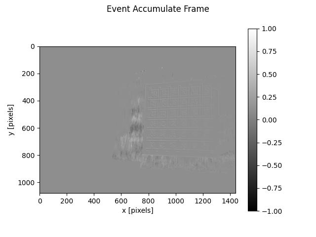
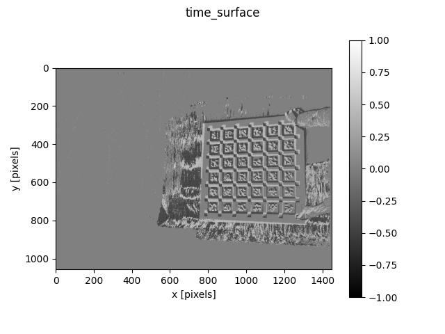
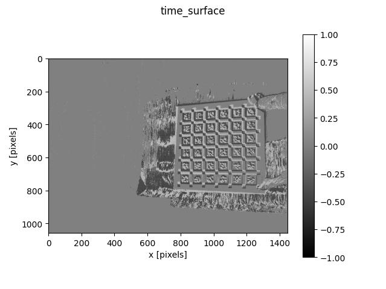

# event-camera-image-deblurring
**Detailed description will come soon.**

## 目录

- [简介](#简介)
- [安装](#安装)
- [使用方法](#使用方法)
- [示例](#示例)
- [贡献](#贡献)
- [许可证](#许可证)
- [联系方式](#联系方式)

## 简介

事件相机提供了一种捕捉视觉信息的新方法，尤其在高速运动和低光照等挑战性条件下表现优异。本项目旨在利用事件相机的优势来改进图像去模糊的效果。**更多的背景信息和详细说明将会在未来更新。**

## 安装

按照以下步骤设置项目环境：

1. 克隆仓库：
   ```bash
   git clone https://github.com/SaberKing29/event-camera-image-deblurring.git

## 使用方法

1.补充代码中的路径信息，然后运行代码。例如
1. 克隆仓库：
   ```bash
   python3 event_accumulate_frame.py
   python3 event_frame.py
   python3 Stacking_Based_on_Time.py

## 示例







## 贡献

欢迎任何形式的贡献！如果您有改进的想法、发现了问题或希望增加新功能，您可以与我取得联系。

## 许可证

本项目采用 [MIT 许可证](https://opensource.org/licenses/MIT) 进行许可。这意味着您可以自由地使用、复制、修改和分发本项目的代码，前提是您在所有的副本或主要部分中保留原始版权声明和许可声明。

有关详细信息，请参阅项目中的 [LICENSE](./LICENSE) 文件。

## 联系方式

如果您有任何问题、建议或反馈，欢迎通过以下方式与我们联系：

- **作者**: SaberKing29
- **GitHub**: [SaberKing29](https://github.com/SaberKing29)
- **电子邮件**: 2292359169@qq.com
